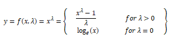
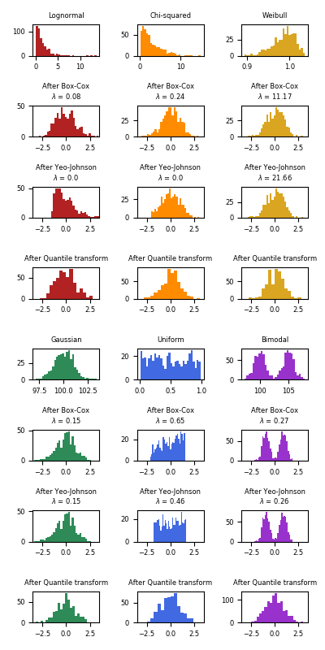
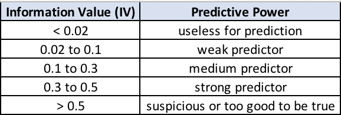

**Table of Contents**:

[TOC]

# A Short Guide for Feature Engineering and Feature Selection

Feature engineering and selection is the art/science of converting data to the best way possible, which involve an elegant blend of domain expertise, intuition and mathematics. This guide is a concise reference for beginners with most simple yet widely used techniques for feature engineering and selection. Any comments and commits are most welcome.

## 0. Basic Concepts

### 0.1 What is Machine Learning

> Machine Learning is the science of getting computers to act without being explicitly programmed  - [Arthur Samuel](https://simple.wikipedia.org/wiki/Machine_learning)

> Machine Learning is a technique of data science that helps computers learn from existing data in order to forecast future behaviors, outcomes and trends  - [Microsoft](https://docs.microsoft.com/en-us/azure/machine-learning/service/overview-what-is-azure-ml)

> The field of Machine Learning seeks to answer the question “How can we build computer systems that automatically improve with experience, and what are the fundamental laws that govern all learning processes?“ - [Carnegie Mellon University](http://www.cs.cmu.edu/~tom/pubs/MachineLearning.pdf)

Narrowly speaking, in data mining context, machine learning (ML) is the process of letting computers to learn from historical data, recognize pattern/relationship within data, and then make predictions.

### 0.2 Methodology

A typical ML workflow/pipeline looks like this:

[img source](https://www.springer.com/us/book/9781484232064) 

There can be many ways to divide the tasks that make up the ML workflow into phases. But generally the basic steps are similar as the graph above.

### 0.3 Typical Tasks

| Task              | Definition                                    | Example                              |
| ----------------- | --------------------------------------------- | ------------------------------------ |
| Classification    | predict what category new instance belongs to | is the tumor malign/benign?          |
| Regression        | predict a continuous numeric value            | predict house/stock prices in future |
| Anomaly Detection | identify outliers                             | fraud detection                      |
| Clustering        | separate similar data points into groups      | customer segmentation                |

### 0.4 Terminology

- **Feature**: also known as Attribute/ Independent Variable/ Predictor/ Input Variable. It's an individual measurable property/characteristic of a phenomenon being observed  [[wiki]](https://en.wikipedia.org/wiki/Feature_(machine_learning)).  The age of a person, etc.
- **Target**: also known as Dependent Variable/ Response Variable/ Output Variable. It's the variable being predicted in supervised learning.
- **Algorithm**: the specific procedure used to implement a particular ML technique. Linear Regression, etc.
- **Model**: the algorithm applied to a dataset, complete with its settings (its parameters). Y=4.5x+0.8, etc. We want the model that best captures the relationship between features and the target.
- **Supervised learning** : train the model with labeled data to generate reasonable predictions for the response to new data.
- **Unsupervised learning** : train the model with un-labeled data to find intrinsic structures/ patterns within the data.
- **Reinforcement learning**: the model is learned from a series of actions by maximizing a reward function, which can either be maximized by penalizing bad actions and/or rewarding good actions. Self-driving, etc.

## 1. Data Exploration

### 1.1 Variables

**Definition**: any measurable property/characteristic of a phenomenon being observed. They are called 'variables' because the value they take may vary (and it usually does) in a population. 

**Types of Variable**

| Type        | Sub-type   | Definition                                                   | Example                        |
| ----------- | ---------- | ------------------------------------------------------------ | ------------------------------ |
| Categorical | Nominal    | Variables with values selected from a group of categories, while not having any kind of natural order. [ref](http://www-ist.massey.ac.nz/dstirlin/CAST/CAST/Hstructures/structures_c2.html) | Gender, car types              |
|             | Ordinal    | A categorical variable whose categories can be meaningfully ordered. [ref](http://www-ist.massey.ac.nz/dstirlin/CAST/CAST/Hstructures/structures_c2.html) | Grade of an exam               |
| Numerical   | Discrete   | Variables whose values are either finite or countably infinite. [wiki](https://en.wikipedia.org/wiki/Continuous_or_discrete_variable) | Number of children in a family |
|             | Continuous | Variable which can take on infinitely many, uncountable values. [wiki](https://en.wikipedia.org/wiki/Continuous_or_discrete_variable) | House prices, time passed      |

### 1.2 Variable Identification

**Definition**: Identify the data types of each variable.

**Note**:  In reality we may have mixed type of variable for a variety of reasons. For example, in credit scoring "Missed payment status" is a common variable that can take values 1, 2, 3 meaning that the customer has missed 1-3 payments in their account. And it can also take the value D, if the customer defaulted on that account. We may have to convert data types after certain steps of data cleaning.

### 1.3 Univariate Analysis

Descriptive statistics on one single variable.

| Variable    | What to look for                                             |
| ----------- | ------------------------------------------------------------ |
| Categorical | **Shape**: Histogram/ Frequency table...                |
| Numerical   | **Central Tendency**: Mean/ Median/ Mode **Dispersion**: Min/ Max/ Range/ Quantile/ IQR/ MAD/ Variance/ Standard Deviation/  **Shape**: Skewness/ Histogram/ Boxplot... |

Below are some methods that can give us the basic stats on the variable:

- pandas.Dataframe.describe()
- pandas.Dataframe.dtypes
- Barplot
- Countplot
- Boxplot
- Distplot

### 1.4 Bi-variate Analysis

Descriptive statistics between two or more variables.

- Scatter Plot
- Correlation Plot
- Heat Map

**Scatter Plot** is a type of plot or mathematical diagram using Cartesian coordinates to display values for typically two variables for a set of data. If the pattern of dots slopes from lower left to upper right, it indicates a positive correlation between the variables being studied. If the pattern of dots slopes from upper left to lower right, it indicates a negative correlation. [[wiki]](https://en.wikipedia.org/wiki/Scatter_plot)

**Correlation plot** can be used to quickly find insights. It is used to investigate the dependence between multiple variables at the same time and to highlight the most correlated variables in a data table.

**Heat map** (or heatmap) is a graphical representation of data where the individual values contained in a matrix are represented as colors.

## 2. Feature Cleaning

### 2.1 Missing Values

**Definition**: no value is stored in a certain observation within a variable.

#### 2.1.1 Why Missing Data Matters

- certain algorithms cannot work when missing value are present
- even for algorithm that handle missing data, without treatment the model can lead to inaccurate conclusion

A study on the impact of missing data on different ML algorithm can be found [here](http://core.ecu.edu/omgt/krosj/IMDSDataMining2003.pdf).

#### 2.1.2 Missing Mechanisms [1]

It is important to understand the mechanisms by which missing fields are introduced in a dataset. Depending on the mechanism, we may choose to process the missing values differently. The mechanisms were first introduced by Rubin [2].

**Missing Completely at Random**

A variable is missing completely at random (MCAR) if the probability of being missing is the same for all the observations. When data is MCAR, there is absolutely no relationship between the data missing and any other values, observed or missing, within the dataset. In other words, those missing data points are a random subset of the data. There is nothing systematic going on that makes some data more likely to be missing than other.

If values for observations are missing completely at random, then disregarding those cases would not bias the inferences made.

**Missing at Random**

Missing as Random (MAR) occurs when there is a systematic relationship between the propensity of missing values and the observed data. In other words, the probability an observation being missing depends only on available information (other variables in the dataset), but not on the variable itself.

For example, if men are more likely to disclose their weight than women, weight is MAR (on variable gender). The weight information will be missing at random for those men and women that decided not to disclose their weight, but as men are more prone to disclose it, there will be more missing values for women than for men.

In a situation like the above, if we decide to proceed with the variable with missing values, we might benefit from including gender to control the bias in weight for the missing observations.

**Missing Not At Random -  Depends on Unobserved Predictors**

Missingness depends on information that has not been recorded, and this information also predicts the missing values. E.g., if a particular treatment causes discomfort, a patient is more likely to drop out of the study (and 'discomfort' is not measured).

In this situation, data sample is biased if we drop those missing cases.

**Missing Not At Random -  Depends on Missing Value Itself**

Missingness depends on the (potentially missing) variable itself. E.g., people with higher earnings are less likely to reveal them.

#### 2.1.3 How to Assume a Missing Mechanism

- By **business understanding**. In many situations we can assume the mechanism by probing into the business logic behind that variable.
- By **statistical test**.  Divide the dataset into ones with/without missing and perform t-test to see if there's significant differences. If there is, we can assume that missing is not completed at random.

But we should keep in mind that we can hardly 100% be sure that data are MCAR, MAR, or MNAR because unobserved predictors (lurking variables) are unobserved. 

#### 2.1.4 How to Handle Missing Data

| Method                         | Definition                                                   | Pros                                                   | Cons                                                         |
| ------------------------------ | ------------------------------------------------------------ | ------------------------------------------------------ | ----------------------------------------------------------- |
| Listwise Deletion              | excluding all cases (listwise) that have missing values      | preserve distribution if MCAR                          | 1. may discard too much data and hurt the model 2. may yield biased estimates if not MCAR (as we keep a special subsample from the population) |
| Mean/Median/Mode Imputation    | replacing the NA by mean/median/most frequent values (for categorical feature) of that variable | good practice if MCAR                                  | 1. distort distribution 2. distort relationship with other variables |
| End of distribution Imputation | replacing the NA by values that are at the far end of the distribution of that variable, calculated by mean + 3*std | Captures the importance of missingness if there is one | 1. distort distribution 2. may be considered outlier if NA is few or mask true outlier if NA is many. 3. if missingness is not important this may mask the predictive power of the original variable |
| Random Imputation              | replacing the NA by taking a random value from the pool of available observations of that variable | preserve distribution if MCAR                          | not recommended in business settings for its randomness (different result for same input) |
| Arbitrary Value Imputation     | replacing the NA by arbitrary values                         | Captures the importance of missingness if there is one | 1. distort distribution 2. typical used value: -9999/9999. But be aware it may be regarded as outliers. |
| Add a variable to denote NA    | creating an additional variable indicating whether the data was missing for that observation | Captures the importance of missingness if there is one | expand feature space                                         |

In real settings, when it's hard to decide the missing mechanism or there's few time to study deeply about each missing variables, the popular way is to adopt:

- Mean/Median/Mode Imputation (depend on the distribution)
- End of distribution Imputation
- Add a variable to denote NA

simultaneously, so that we both catch the value of missingness and obtain a complete dataset.

**Note**: Some algorithms like XGboost incorporate missing data treatment into its model building process, so you don't need to do the step. However it's important to make sure you understand how the algorithm treat them and explain to the business team.

### 2.2 Outliers

**Definition**:  An outlier is an observation which deviates so much from the other observations as to arouse suspicions that it was generated by a different mechanism. [3]  

**Note**:  Outliers, depending on the context, either deserve special attention or should be completely ignored. For example, an unusual transaction on a credit card is usually a sign of fraudulent activity, while a height of 1600cm of a person is very likely due to measurement error and should be filter out or impute with something else.

#### 2.2.1 Why Outlier Matters

The presence of outliers may:

- make algorithm not work properly
- introduce noises to dataset
- make samples less representative

Some algorithms are very sensitive to outliers, For example, Adaboost may treat outliers as "hard" cases and put tremendous weights on outliers, therefore producing a model with bad generalization. Any algorithms that rely on means/variance are sensitive to outliers as those stats are greatly influenced by extreme values.

On the other hand some algorithm are more robust to outliers. For example, decision trees tend to ignore the presence of outliers when creating the branches of their trees. Typically, trees make splits by asking if variable x >= value t, and therefore the outlier will fall on each side of the branch, but it will be treated equally as the remaining values, regardless of its magnitude.

#### 2.2.2 Outlier Detection

In fact outlier analysis and anomaly detection is a huge field of research. Charu's book "Outlier Analysis" [4] offer a great insight into the topic. PyOD[5] is a comprehensive Python toolkit which contains many of the advanced methods in this field.

All the methods here listed are for univariate outlier detection. Multivariate outlier detection is beyond the scope of this guide.

| Method                                   | Definition                                                   | Pros                                                         | Cons                                                         |
| ---------------------------------------- | ------------------------------------------------------------ | ------------------------------------------------------------ | ------------------------------------------------------------ |
| Detect by arbitrary boundary             | identify outliers based on arbitrary boundaries              | flexiable                                                    | require business understanding                               |
| Mean & Standard Deviation method [6],[7] | outlier detection by Mean & Standard Deviation Method        | good for variable with Gaussian distribution (68-95-99 rule) | sensitive to extreme value itself (as the outlier increase the sd) |
| IQR method [8]                           | outlier detection by Interquartile Ranges Rule               | robust than Mean & SD method as it use quantile & IQR. Resilient to extremes. | can be too aggressive                                        |
| MAD method [6],[7]                       | outlier detection by Median and Median Absolute Deviation Method | robust than Mean & SD method. Resilient to extremes.         | can be too aggressive                                        |

However, beyond these methods, it's more important to keep in mind that the business context should govern how you define and react to these outliers. The meanings of your findings should be dictated by the underlying context, rather than the number itself.

#### 2.2.3 How to Handle Outliers

| Method                          | Definition                                                   | Pros                             | Cons                                        |
| ------------------------------- | ------------------------------------------------------------ | -------------------------------- | ------------------------------------------- |
| Mean/Median/Mode Imputation     | replacing the outlier by mean/median/most frequent values of that variable | preserve distribution            | lose information of outlier if there is one |
| Discretization                  | transform continuous variables into discrete variables       | minimize the impact from outlier | lose information of outlier if there is one |
| Imputation with arbitrary value | impute outliers with arbitrary value.                        | flexiable                        | hard to decide the value                    |
| Windsorization                  | top-coding & bottom coding (capping the maximum of a distribution at an arbitrarily set value, vice versa). | prevent model over-fitting       | distort distribution                        |
| Discard outliers                | drop all the observations that are outliers                  | /                                | lose information of outlier if there is one |

**Note**: A detailed guide of doing windsorization can be found [here](https://www.statisticshowto.datasciencecentral.com/winsorize/).

There are many strategies for dealing with outliers in data, and depending on the context and data set, any could be the right or the wrong way. It’s important to investigate the nature of the outlier before deciding.

### 2.3 Rare Values

**Definition**: Categorical variable with some of its values appear only seldomly.

**Note**:  In some situations rare values, like outliers, may contains valuable information of the dataset and therefore need particular attention. For example, a rare value in transaction may denote fraudulent.

#### 2.3.1 Why Rare Value Matters

- Rare values in categorical variables tend to cause over-fitting, particularly in **tree based** methods.
- A big number of infrequent labels adds noise, with little information, therefore causing over-fitting.
- Rare labels may be present in training set, but not in test set, therefore causing over-fitting to the train set.
- Rare labels may appear in the test set, and not in the train set. Thus, the model will not know how to evaluate it. 

#### 2.3.2 How to Handle Rare Value

| Method                         | Definition                                                   |
| ------------------------------ | ------------------------------------------------------------ |
| Mode Imputation                | Replacing the rare label by most frequent label              |
| Grouping into one new category | Grouping the observations that show rare labels into a unique category |

Depending on the situation, we may use different strategies:

- when **there's one predominant category (over 90%)** in the variable: observe the relationship between that variable and the target, then either discard that variable, or keep it as it was. In this case, variable often is not useful for prediction as it is quasi-constant (as we will later see in Feature Selection part).
- when **there's a small number of categories**: keep it as it was. Because only few categories are unlikely to bring so much noise.
- when **there's high cardinality**: try the 2 methods above. But it does not guarantee better results than original variable.

### 2.4 High Cardinality

**Definition**: The number of labels within a categorical variable is known as  cardinality. A high number of labels within a variable is known as high cardinality. 

#### 2.4.1 Why High Cardinality Matters

- Variables with too many labels tend to dominate over those with only a few labels, particularly in **tree based** algorithms.
- A big number of labels within a variable may introduce noise with little if any information, therefore making the machine learning models  prone to over-fit.
- Some of the labels may only be present in the training data set,  but not in the test set, therefore causing algorithms to over-fit the training set.
- Contrarily, new labels may appear in the test set that were not  present in the training set, therefore leaving algorithm unable to perform a calculation over the new observation.

#### 2.4.2 How to Handle High Cardinality

| Method                                                 |
| ------------------------------------------------------ |
| Grouping labels with business understanding            |
| Grouping labels with rare occurrence into one category |
| Grouping labels with decision tree                     |

All these methods attempt to group some of the labels and reduce cardinality. Grouping labels with decision tree is equivalent to the method introduced in section 3.2.2 Discretization with decision tree, which aims to merge labels into more homogenous groups. Grouping labels with rare occurrence into one category is equivalent to method in section 2.3.2.

## 3. Feature Engineering

### 3.1 Feature Scaling

**Definition**: Feature scaling is a method used to standardize the range of independent variables or features of data. In data processing, it is also known as data normalization and is generally performed during the data preprocessing step.

#### 3.1.1 Why Feature Scaling Matters

- If range of inputs varies, in some algorithms, object functions will not work properly.

- **Gradient descent** converges much faster with feature scaling done. Gradient descent is a common optimization algorithm used in logistic regression, SVMs,  neural networks etc.

- Algorithms that involve **distance calculation** like KNN, Clustering are also affected by the magnitude of the feature. Just consider how Euclidean distance is calculated: taking the square root of the sum of the squared differences between observations. This distance can be greatly affected by differences in scale among the variables. Variables with large variances have a larger effect on this measure than variables with small variances.

**Note**: Tree-based algorithms are almost the only algorithms that are not affected by the magnitude of the input, as we can easily see from how trees are built.  When deciding how to make a split, tree algorithm look for decisions like "whether feature value X>3.0" and compute the purity of the child node after the split, so the scale of the feature does not count.

#### 3.1.2 How to Handle Feature Scaling

| Method                                            | Definition                                                   | Pros                                                         | Cons                                                         |
| ------------------------------------------------- | ------------------------------------------------------------ | ------------------------------------------------------------ | ------------------------------------------------------------ |
| Normalization - Standardization (Z-score scaling) | removes the mean and scales the data to unit variance. z = (X - X.mean) /  std | feature is rescaled to have a standard normal distribution that centered around 0 with SD of 1 | compress the observations in the narrow range if the variable is skewed or has outliers, thus impair the predictive power. |
| Min-Max scaling                                   | transforms features by scaling each feature to a given range. Default to [0,1]. X_scaled = (X - X.min / (X.max - X.min) | /                                                            | compress the observations in the narrow range if the variable is skewed or has outliers, thus impair the predictive power. |
| Robust scaling                                    | removes the median and scales the data according to the quantile range (defaults to IQR) X_scaled = (X - X.median) / IQR | better at preserving the spread of the variable after transformation for skewed variables | /                                                            |

A comparison of three methods when facing outliers:

[img source](https://stackoverflow.com/questions/51841506/data-standardization-vs-normalization-vs-robust-scaler)

As we can see, Normalization - Standardization and Min-Max method will compress most data to a narrow range, while robust scaler does a better job at keeping the spread of the data, although it cannot **remove** the outlier from the processed result. Remember removing/imputing outliers is another topic in data cleaning and should be done beforehand.

Experience on how to choose feature scaling method:

- If your feature is not Gaussian like, say, has a skewed distribution or has outliers, Normalization - Standardization is not a good choice as it will compress most data to a narrow range.
- However, we can transform the feature into Gaussian like and then use Normalization - Standardization. Feature transformation will be discussed in section 3.4
- When performing distance or covariance calculation (algorithm like Clustering, PCA and LDA), it is better to use Normalization - Standardization as it will remove the effect of scales on variance and covariance. Explanation [here](https://blog.csdn.net/zbc1090549839/article/details/44103801).
- Min-Max scaling has the same drawbacks as Normalization - Standardization, and also new data may not be bounded to [0,1] as they can be out of the original range. Some algorithms, for example some deep learning network prefer input on a 0-1 scale so this is a good choice.

Below is some additional resource on this topic:

- A comparison of the three methods when facing skewed variables can be found [here](https://scikit-learn.org/stable/auto_examples/preprocessing/plot_all_scaling.html#sphx-glr-auto-examples-preprocessing-plot-all-scaling-py).
- An in-depth study of feature scaling can be found [here](http://sebastianraschka.com/Articles/2014_about_feature_scaling.html).

### 3.2 Discretize

**Definition**: Discretization is the process of transforming continuous variables into discrete variables by creating a set of contiguous intervals that spans the range of the variable's values.

#### 3.2.1 Why Discretize Matters

- help to improve model performance by grouping of similar attributes with similar predictive strengths
- bring into non-linearity and thus improve fitting power of the model
- enhance interpretability with grouped values
- minimize the impact of **extreme values/seldom reversal patterns**
- prevent overfitting possible with numerical variables
- allow feature interaction between continuous variables (section 3.5.5)

#### 3.2.2 How to Handle Discretization

| Method                              | Definition                                                   | Pros                                                         | Cons                                                         |
| ----------------------------------- | ------------------------------------------------------------ | ------------------------------------------------------------ | ------------------------------------------------------------ |
| Equal width binning                 | divides the scope of possible values into N bins of the same width | /                                                            | sensitive to skewed distribution                             |
| Equal frequency binning             | divides the scope of possible values of the variable into N bins, where each bin carries the same amount of observations | may help boost the algorithm's performance                   | this arbitrary binning may disrupt the relationship with the target |
| K-means binning                     | using k-means to partition values into clusters              | /                                                            | needs hyper-parameter tuning                                 |
| Discretization using decision trees | using a decision tree to identify the optimal splitting points that would determine the bins | observations within each  bin are more similar to themselves than to those of other bins | 1. may cause over-fitting 2. may not get a good performing tree |
| ChiMerge[11]                       | supervised hierarchical bottom-up (merge) method that locally exploits the chi-square criterion to decide whether two adjacent intervals are similar enough to be merged | robust and make use of a priori knowledge                    | cannot handle unlabeled data                                 |

In general there's no best choice of discretization method. It really depends on the dataset and the following learning algorithm. Study carefully about your features and context before deciding. You can also try different methods and compare the model performance.

Some literature reviews on feature discretization can be found [here1](https://pdfs.semanticscholar.org/94c3/d92eccbb66f571153f99b7ae6c6167a00923.pdf), [here2](http://robotics.stanford.edu/users/sahami/papers-dir/disc.pdf), [here3](http://axon.cs.byu.edu/papers/ventura.thesis.ps).

### 3.3 Feature Encoding

#### 3.3.1 Why Feature Encoding Matters

We must transform strings of categorical variables into numbers so that algorithms can handle those values. Even if you see an algorithm can take into categorical inputs, it's most likely that the algorithm incorporate the encoding process within.

#### 3.3.2 How to Handle Feature Encoding

| Method                   | Definition                                                   | Pros                                                         | Cons                                                         |
| ------------------------ | ------------------------------------------------------------ | ------------------------------------------------------------ | ------------------------------------------------------------ |
| One-hot encoding         | replace the categorical variable by different boolean variables (0/1) to indicate whether or not certain label is true for that observation | keep all information of that variable                        | 1. expand feature space dramatically if too many labels in that variable 2. does not add additional value to make the variable more predictive |
| Ordinal-encoding         | replace the labels by some ordinal number if ordinal is meaningful | straightforward                                              | does not add additional value to make the variable more predictive |
| Count/frequency encoding | replace each label of the categorical variable by the count/frequency within that category | /                                                            | 1. may yield same encoding for two different labels (if they appear same times) and lose valuable info. 2. may not add predictive power |
| Mean encoding     | replace the label by the mean of the target for that label. (the target must be 0/1 valued or continuous) | 1. Capture information within the label, therefore rendering more predictive features 2. Create a monotonic relationship between the variable and the target 3. Do not expand the feature space | Prone to cause over-fitting                                  |
| WOE encoding[9]         | replace the label  with Weight of Evidence of each label. WOE is computed from the basic odds ratio: ln( (Proportion of Good Outcomes) / (Proportion of Bad Outcomes)) | 1. Establishes a monotonic relationship to the dependent variable 2. Orders the categories on a "logistic" scale which is natural for logistic regression 3，The transformed variables, can then be compared because they are on the same scale. Therefore, it is possible to determine which one is more predictive. | 1. May incur in loss of information (variation) due to binning to few categories 2. Prone to cause over-fitting |
| Target encoding[10]     | Similar to mean encoding, but use both posterior probability and prior probability of the target | 1. Capture information within the label, therefore rendering more predictive features 2. Create a monotonic relationship between the variable and the target 3. Do not expand the feature space | Prone to cause over-fitting      |

**Note**: if we are using one-hot encoding in linear regression, we should keep k-1 binary variable to avoid multicollinearity. This is true for any algorithms that look at all features at the same time during training. Including SVM, neural network and clustering. Tree-based algorithm, on the other hand, need the entire set of binary variable to select the best split.

**Note**: it is not recommended to use one-hot encoding with tree algorithms. One-hot will cause the split be highly imbalanced (as each label of the original categorical feature will now be a new feature), and the result is that neither of the two child nodes will have a good gain in purity. The prediction power of the one-hot feature will be weaker than the original feature as they have been broken into many pieces.

An in-detail intro to WOE can be found [here](http://documentation.statsoft.com/StatisticaHelp.aspx?path=WeightofEvidence/WeightofEvidenceWoEIntroductoryOverview).

### 3.4 Feature Transformation

#### 3.4.1 Why Feature Transformation Matters

##### 3.4.1.1 Linear Assumption

**Regression**

Linear regression is a straightforward approach for predicting a  quantitative response Y on the basis of a different predictor variable  X1, X2, ... Xn. It assumes that there is a linear relationship between  X(s) and Y. Mathematically, we can write this linear relationship as Y ≈  β0 + β1X1 + β2X2 + ... + βnXn. 

**Classification**

Similarly, for classification, Logistic Regression assumes a linear relationship between the variables and the log of the odds.

Odds = p / (1 - p), where p is the probability of y = 1

log(odds) = β0 + β1X1 + β2X2 + ... + βnXn

**Why it's important to follow linear assumption**

If the machine learning model assumes a linear dependency between the predictors Xs and the outcome Y, when there is not such a linear relationship, the model will have a poor performance. In such cases, we are better off trying another machine learning model that does not make such assumption.

If there is no linear relationship and we have to use the linear/logistic regression models, mathematical transformation/discretization may help create the relationship, though it cannot guarantee a better result.

##### 3.4.1.2 Variable Distribution

**Linear Regression Assumptions**

Linear Regression has the following assumptions over the predictor variables X:

- Linear relationship with the outcome Y

- Multivariate normality
- No or little multicollinearity
- Homoscedasticity

Normality assumption means that every variable X should follow a Gaussian distribution.

Homoscedasticity, also known as homogeneity of variance, describes a situation in which the error term (that is, the “noise” or random disturbance in the relationship between the independent variables (Xs) and the dependent variable (Y)) is the same across all values of the independent variables.

Violations in the assumptions of homoscedasticity and / or normality (assuming a distribution of data is homoscedastic or Gaussian, when in reality it is not) may result in poor model performance.

The remaining machine learning models, including Neural Networks, Support Vector Machines, Tree based methods and PCA do not make any assumption over the distribution of the independent variables. However, in many occasions the model performance may **benefit from a "Gaussian-like" distribution**.

Why may models benefit from a "Gaussian-like" distributions? In variables with a normal distribution, the observations of X available to predict Y vary across a greater range of values, that is, the values of X are "spread" over a greater range.

In the situations above, transformation of the original variable can help give the variable more of a bell-shape of the Gaussian distribution.

#### 3.4.2 How to Handle Feature Transformation

| Method                      | Definition                                               |
| --------------------------- | -------------------------------------------------------- |
| Logarithmic transformation  | log(x+1).  We use (x+1) instead of x to avoid value of 0 |
| Reciprocal transformation   | 1/x. Warning that x should not be 0.                     |
| Square root transformation  | x**(1/2)                                                 |
| Exponential transformation  | X**(m)                                                   |
| Box-cox transformation[12] | (X**λ-1)/λ                                               |
| Quantile transformation     | transform features using quantiles information           |

**Log transformation** is useful when applied to skewed distributions as they tend to expand the values which fall in the range of lower magnitudes and tend to compress or reduce the values which fall in the range of higher magnitudes, which helps to make the skewed distribution as normal-like as possible. **Square root transformation** does a similar thing in this sense.

**Box-Cox transformation** in sklearn [13] is another popular function belonging to the power transform family of functions. This function has a pre-requisite that the numeric values to be transformed must be positive (similar to what log transform expects). In case they are negative, shifting using a constant value helps. Mathematically, the Box-Cox transform function can be denoted as follows.

**Quantile transformation** in sklearn [14] transforms the features to follow a uniform or a normal distribution. Therefore, for a given feature, this transformation tends to spread out the most frequent values. It also reduces the impact of (marginal) outliers: this is therefore a robust preprocessing scheme. However, this transform is non-linear. It may distort linear correlations between variables measured at the same scale but renders variables measured at different scales more directly comparable.

We can use **Q-Q plot** to check if the variable is normally distributed (a 45 degree straight line of the values over the theoretical quantiles) after transformation.

Below is an example showing the effect of sklearn's Box-plot/Yeo-johnson/Quantile transform to map data from various distributions to a normal distribution.

[img source](https://scikit-learn.org/stable/auto_examples/preprocessing/plot_map_data_to_normal.html#sphx-glr-auto-examples-preprocessing-plot-map-data-to-normal-py) 

On “small” datasets (less than a few hundred points), the quantile transformer is prone to overfitting. The use of the power transform is then recommended.

### 3.5 Feature Generation

**Definition**: Creating new features as a combination of existing ones. It's a great way to add domain knowledge to the dataset.

#### 3.5.1 Missing Data Derived Feature

As mentioned in section 2.1, we can create new binary feature denoting whether the observations have missing value on raw feature with value 0/1.

#### 3.5.2 Simple Statistical Derived Feature

Creating new features by performing simple statistical calculations on the raw features, including:

 - count/sum
 - average/median/mode
 - max/min/stddev/variance/range/IQR/Coefficient of Variation
 - time span/interval

Take call log for example, we can create new features like: number of calls, number of call-in/call-out, average calling duration, monthly average calling duration, max calling duration, etc.

#### 3.5.3 Feature Crossing

After having some simple statistical derived features, we can have them crossed together. Common dimensions used for crossing include:

- time
- region
- business types

Still take call log for example, we can have crossed features like: number of calls during night times/day times, number of calls under different business types (banks/taxi services/travelling/hospitalities), number of calls during the past 3 months, etc. Many of the statistical calculations mentioned in section 3.5.2 can be used again to create more features.

**Note**: An open-source python framework named **Featuretools** that helps automatically generate such features can be found [here](https://github.com/Featuretools/featuretools). 

Personally I haven't used it in practice. You may try and discover if it can be of industry usage.

#### 3.5.4 Ratios and Proportions

Common techniques. For example, in order to predict future performance of credit card sales of a branch, ratios like credit card sales / sales person or credit card sales / marketing spend would be more powerful than just using absolute number of card sold in the branch.

#### 3.5.5 Cross Products between Categorical Features

Consider a categorical feature A, with two possible values {A1, A2}. Let B be a feature with possibilities {B1, B2}. Then, a feature-cross between A & B  would take one of the following values: {(A1, B1), (A1, B2), (A2, B1), (A2, B2)}. You can basically give these ‘combinations’ any names you like. Just remember that every combination denotes a synergy between the information contained by the corresponding values of A and B.

This is an extremely useful technique, when certain features together denote a property better than individually by themselves. Mathematically speaking, you are doing a cross product between all possible values of the categorical features. The concepts is similar to Feature Crossing of section 3.5.3, but this one particularly refers to the crossing between 2 categorical features.

#### 3.5.6 Polynomial Expansion

The cross product can also be applied to numerical features, which results in a new interaction feature between A and B. This can be done easily be sklearn's  [PolynomialFeatures](https://scikit-learn.org/stable/modules/generated/sklearn.preprocessing.PolynomialFeatures.html#sklearn.preprocessing.PolynomialFeatures), which generate a new feature set consisting of all polynomial combinations of the features with degree less than or equal to the specified degree. For example, three raw features {X1, X2, X3} can generate a feature set of  {1, X1X2, X1X3, X2X3, X1X2X3} with a degree of 2.

#### 3.5.7 Feature Learning by Trees

In tree-based algorithms, each sample will be assigned to a particular leaf node. The decision path to each node can be seen as a new non-linear feature, and we can create N new binary features where n equals to the total number of leaf nodes in a tree or tree ensembles. The features can then be fed into other algorithms such as logistic regression.

The idea of using tree algorithm to generate new features is first introduced by Facebook in this [paper](http://quinonero.net/Publications/predicting-clicks-facebook.pdf).

The good things about this method is that we can get a complex combinations of several features together, which is informative (as is constructed by the tree's learning algorithm). This saves us much time compared to doing feature crossing manually, and is widely used in CTR (click-through rate) of online advertising industry.

#### 3.5.8 Feature Learning by Deep Networks

As we can see from all above, feature generation by manual takes lots of effort and may not guarantee good returns, particular when we have huge amounts of features to work with. Feature learning with trees can be seen as an early attempt in creating features automatically, and with the deep learning methods come into fashion from around 2016, they also have achieved some success in this area, such as **autoencoders** and **restricted Boltzmann machines**. They have been shown to automatically and in a unsupervised or semi-supervised way, learn abstract representations of features (a compressed form), that in turn have supported state-of-the-art results in domains such as speech recognition, image classification, object recognition and other areas. However, such features have limited interpretability and deep learning require much more data to be able to extract high quality result.

## 4. Feature Selection

**Definition**:  Feature Selection is the process of selecting a subset of relevant features for use in machine learning model building. 

It is not always the truth that the more data, the better the result will be. Including irrelevant features (the ones that are just unhelpful to the prediction) and redundant features (irrelevant in the presence of others) will only make the learning process overwhelmed and easy to cause overfitting.

With feature selection, we can have:

- simplification of models to make them easier to interpret
- shorter training times and lesser computational cost
- lesser cost in data collection
- avoid the curse of dimensionality
- enhanced generalization by reducing overfitting 

We should keep in mind that different feature subsets render optimal performance for different algorithms. So it's not a separate process along with the machine learning model training. Therefore, if we are selecting features for a linear model, it is better to use selection procedures targeted to those models, like importance by regression coefficient or Lasso. And if we are selecting features for trees, it is better to use tree derived importance.

### 4.1 Filter Method

Filter methods select features based on a performance measure regardless of the ML algorithm later employed.

Univariate filters evaluate and rank a single feature according to a certain criteria, while multivariate filters evaluate the entire feature space. Filter methods are:

- selecting variable regardless of the model
- less computationally expensive
- usually give lower prediction performance

As a result, filter methods are suited for a first step quick screen and removal of irrelevant features.

| Method                    | Definition                                                   |
| ------------------------- | ------------------------------------------------------------ |
| Variance                  | removing features that show the same value for the majority/all of the observations (constant/quasi-constant features) |
| Correlation               | remove features that are highly correlated with each other   |
| Chi-Square                | Compute chi-squared stats between each non-negative feature and class |
| Mutual Information Filter | Mutual information measures how much information the presence/absence of a feature contributes to making the correct prediction on Y. |
| Univariate ROC-AUC or MSE | builds one decision tree per feature, to predict the target, then make predictions and ranks the features according to the machine learning metric (roc-auc or mse) |
| Information Value (IV)    | a byproduct of WOE.  IV = Σ(Proportion of Good Outcomes - Proportion of Bad Outcomes) * WOE |

WOE encoding (see section 3.3.2) and IV often go hand in hand in scorecard development. The two concepts both derived from logistic regression and is kind of standard practice in credit card industry.  IV is a popular and widely used measure as there are very convenient rules of thumb for variables selection associated with IV as below:

However, all these filtering methods fail to consider the interaction between features and may reduce our predict power. Personally I only use variance and correlation to filter some absolutely unnecessary features.

**Note**: One thing to keep in mind when using chi-square test or univariate selection methods, is that in very big datasets, most of the features will show a small p_value, and therefore look like they are highly predictive. This is in fact an effect of the sample size. So care should be taken when selecting features using these procedures. An ultra tiny p_value does not highlight an ultra-important feature, it rather indicates that the dataset contains too many samples. 

**Note**: Correlated features do not necessarily affect model performance (trees, etc), but high dimensionality does and too many features hurt model interpretability. So it's always better to reduce correlated features.

### 4.2 Wrapper Method

Wrappers use a search strategy to search through the space of possible feature subsets and evaluate each subset by the quality of the performance on a ML algorithm. Practically any combination of search strategy and algorithm can be used as a wrapper. It is featured as:

- use ML models to score the feature subset
- train a new model on each subset
- very computationally expensive
- usually provide the best performing subset for a give ML algorithm, but probably not for another
- need an arbitrary defined stopping criteria

The most common **search strategy** group is Sequential search, including Forward Selection, Backward Elimination and Exhaustive Search. Randomized search is another popular choice, including Evolutionary computation algorithms such as genetic, and Simulated annealing.

Another key element in wrappers is **stopping criteria**. When to stop the search? In general there're three:

- performance increase
- performance decrease
- predefined number of features is reached

#### 4.2.1 Forward Selection

Step forward feature selection starts by evaluating all features individually and selects the one that generates the best performing algorithm, according to a pre-set evaluation criteria. In the second step, it evaluates all possible combinations of the selected feature and a second feature, and selects the pair that produce the best performing algorithm based on the same pre-set criteria.

The pre-set criteria can be the roc_auc for classification and the r squared for regression for example. 

This selection procedure is called greedy, because it evaluates all possible single, double, triple and so on feature combinations. Therefore, it is quite computationally expensive, and sometimes, if feature space is big, even unfeasible.

There is a special package for python that implements this type of feature selection: [mlxtend](https://github.com/rasbt/mlxtend).

#### 4.2.2 Backward Elimination

Step backward feature selection starts by fitting a model using all features. Then it removes one feature. It will remove the one that produces the highest performing algorithm (least statistically significant) for a certain evaluation criteria. In the second step, it will remove a second feature, the one that again produces the best performing algorithm. And it proceeds, removing feature after feature, until a certain criteria is met.

The pre-set criteria can be the roc_auc for classification and the r squared for regression for example. 

#### 4.2.3 Exhaustive Feature Selection

In an exhaustive feature selection the best subset of features is selected, over all possible feature subsets, by optimizing a specified performance metric for a certain machine learning algorithm. For example, if the classifier is a logistic regression and the dataset consists of **4** features, the algorithm will evaluate all **15** feature combinations as follows:

- all possible combinations of 1 feature
- all possible combinations of 2 features
- all possible combinations of 3 features
- all the 4 features

and select the one that results in the best performance (e.g., classification accuracy) of the logistic regression classifier.

This exhaustive search is very computationally expensive. In practice for this computational cost, it is rarely used.

#### 4.2.4 Genetic Algorithm

TODO

### 4.3 Embedded Method

Embedded Method combine the advantages of the filter and wrapper methods. A learning algorithm takes advantage of its own variable selection process and performs feature selection and classification at same time. Common embedded methods include Lasso and various types of tree-based algorithms. It is featured as:

- perform feature selection as part of the model building process
- consider interactions between features
- less computationally expensive as it only train the model once, compared to Wrappers
- usually provide the best performing subset for a give ML algorithm, but probably not for another

#### 4.3.1 Regularization with Lasso

Regularization consists in adding a penalty to the different parameters of the machine learning model to reduce the freedom of the model. Hence, the model will be less likely to fit the noise of the training data so less likely to be overfitting.

In linear model regularization, the penalty is applied over the coefficients that multiply each of the predictors. For linear models there are in general 3 types of regularization:

- L1 regularization (Lasso)
- L2 regularization (Ridge)
- L1/L2 (Elastic net)

From the different types of regularization, **Lasso (L1)** has the property that is able to shrink some of the coefficients to zero. Therefore, that feature can be removed from the model.

Both for linear and logistic regression we can use the Lasso regularization to remove non-important features. Keep in mind that increasing the penalization will increase the number of features removed. Therefore, you will need to keep an eye and monitor that you don't set a penalty too high so that to remove even important features, or too low and then not remove non-important features.

Having said this, if the penalty is too high and important features are removed, you should notice a drop in the performance of the algorithm and then realize that you need to decrease the regularization.

Regularization is a large topic. For for information you can refer to here:

- [Least angle and l1 penalised regression: A review](https://projecteuclid.org/download/pdfview_1/euclid.ssu/1211317636)
- [Penalised feature selection and classification in bioinformatics](https://www.ncbi.nlm.nih.gov/pubmed/18562478)
- [Feature selection for classification: A review](https://web.archive.org/web/20160314145552/http://www.public.asu.edu/~jtang20/publication/feature_selection_for_classification.pdf)

- [Machine Learning Explained: Regularization](https://www.r-bloggers.com/machine-learning-explained-regularization/)

#### 4.3.2 Random Forest Importance

Random forests are one of the most popular machine learning algorithms.  They are so successful because they provide in general a good predictive  performance, low overfitting and easy interpretability. This interpretability is given by the fact that it is straightforward to derive the importance of each variable on the tree decision. In other words, it is easy to compute how much each variable is contributing to the decision.

Random forest is a bagging algorithm consists a bunch of base estimators (decision trees), each of them built over a random extraction of the observations from the dataset and a random extraction of the features. Not every tree sees all the features or all the observations, and this guarantees that the trees are **de-correlated** and therefore **less prone to over-fitting.** 

Each tree is also a sequence of yes-no questions based on a single or combination of features. At each split, the question divides the dataset into 2 buckets, each of them hosting observations that are more similar among themselves and different from the ones in the other bucket. Therefore, the importance of each feature is derived by how  "**pure**" each of the buckets is. 

For classification, the measure of impurity is either the **Gini impurity** or the **information gain/entropy**. For regression the measure of impurity is **variance**. Therefore, when training a tree, it is possible to compute how much each feature decreases the impurity. The more a feature decreases the impurity, the more important the feature is. In random forests, the impurity decrease from each feature can be averaged across trees to determine the final importance of the variable.

Selecting features by using tree derived feature importance is a very  straightforward, fast and generally accurate way of selecting good features for machine learning. In particular, if you are going to build tree methods.

However, correlated features will show in a tree similar and lowered importance, compared to what their importance would be if the tree was built without correlated counterparts.

**Limitation**

- correlated features show similar importance

- correlated features importance is lower than real importance, when tree is build without its correlated counterparts

- high carinal variable tend to show higher importance

#### 4.3.3 Gradient Boosted Trees Importance

Similarly to selecting features using Random Forests derived feature importance, we can select features based on the importance derived by gradient boosted trees. And we can do that in one go, or in a recursive manner, depending on how much time we have, how many features are in the dataset, and whether they are correlated or not.

### 4.4 Feature Shuffling

A popular method of feature selection consists in random shuffling the values of a specific variable and determining how that permutation affects the performance metric of the machine learning algorithm. In other words, the idea is to permute the values of each feature, one at the time, and measure how much the permutation decreases the accuracy, or the roc_auc, or the mse of the machine learning model. If the variables are important, this is, highly predictive, a random permutation of their values will decrease dramatically any of these metrics. Contrarily, non-important / non-predictive variables, should have little to no effect on the model performance metric we are assessing.

### 4.5 Hybrid Method

#### 4.5.1 Recursive Feature Elimination

This method consists of the following steps:

1. Rank the features according to their importance derived from a machine learning algorithm: it can be tree importance, or LASSO / Ridge,  or the linear / logistic regression coefficients.
2. Remove one feature -the least important- and build a machine learning algorithm utilizing the remaining features.

3. Calculate a performance metric of your choice: roc-auc, mse, rmse, accuracy.
4. If the metric decreases by more of an arbitrarily set threshold, then that feature is important and should be kept. Otherwise, we can remove that feature.
5. Repeat steps 2-4 until all features have been removed (and therefore evaluated) and the drop in performance assessed.

The method combines the selection process like wrappers and feature importance derivation from ML models like embedded methods so it's called hybrid.

The difference between this method and the step backwards feature  selection lies in that it does not remove all features first in order to determine which one to remove. It removes the least important one, based on the machine learning model derived importance. And then, it makes an assessment as to whether that feature should be removed or not. So it removes each feature only once during selection, whereas step backward feature selection removes all the features at each step of selection.

This method is therefore faster than wrapper methods and generally better than embedded methods. In practice it works extremely well. It does also account for correlations (depending on how stringent you set the arbitrary performance drop threshold). On the downside, the drop in performance assessed to decide whether the feature should be kept or removed, is set arbitrarily. The smaller the drop the more features will be selected, and vice versa.

**Example: Recursive Feature Elimination with Random Forests Importance**

As we talked about in section 4.3.2, Random Forests assign equal or similar importance to features that are highly correlated. In addition, when features are correlated, the  importance assigned is lower than the importance attributed to the feature itself, should the tree be built without the correlated counterparts.

Therefore, instead of eliminating features based on importance **at one time** (from all initial features), we may get a better selection by removing one feature **recursively**, and recalculating the importance on each round.

In this situation, when a feature that is highly correlated to another one is removed, then, the importance of the remaining feature increases. This may lead to a better subset feature space selection. On the downside, building several random forests is quite time consuming, in particular if the dataset contains a high number of features.

#### 4.5.2 Recursive Feature Addition

This method consists of the following steps:

1. Rank the features according to their importance derived from a  machine learning algorithm: it can be tree importance, or LASSO / Ridge,  or the linear / logistic regression coefficients.
2. Build a machine learning model with only 1 feature, the most important one, and calculate the model metric for performance.

3. Add one feature -the most important- and build a machine learning  algorithm utilizing the added and any feature from previous rounds.

4. Calculate a performance metric of your choice: roc-auc, mse, rmse, accuracy.

5. If the metric increases by more than an arbitrarily set threshold,  then that feature is important and should be kept. Otherwise, we can  remove that feature.

6. Repeat steps 2-5 until all features have been removed (and therefore evaluated) and the drop in performance assessed.

The difference between this method and the step forward feature selection  is similar. It does not look for all features first in order to determine which one to add, so it's faster than wrappers.

### 4.6 Dimensionality Reduction

- PCA（主成分分析）

- SVD（奇异值分解）

## 5. Data Leakage

This section is a remainder to myself as I have had made huge mistakes because of not aware of the problem. Data leakage is when information from outside the training dataset is used to create the model [15]. The result is that you may be creating overly optimistic models that are practically useless and cannot be used in production. The model shows great result on both your training and testing data but in fact it's not because your model really has a good generalizability but it uses information from the test data.

While it is well known to use cross-validation or at least separate a validation set in training and evaluating the models, people may easily forget to do the same during the feature engineering & selection process. Keep in mind that the test dataset must not be used in any way to make choices about the model, including feature engineering & selection.

------

**Reference**

1. http://www.simonqueenborough.info/R/basic/missing-data

2.  Rubin, D. B. (1976). Inference and missing data. Biometrika 63(3): 581-592.

3. D. Hawkins. Identification of Outliers, Chapman and Hall , 1980. 

4. https://www.springer.com/gp/book/9781461463955

5. https://github.com/yzhao062/pyod

6. https://docs.oracle.com/cd/E40248_01/epm.1112/cb_statistical/frameset.htm?ch07s02s10s01.html

7. https://www.academia.edu/5324493/Detecting_outliers_Do_not_use_standard_deviation_around_the_mean_use_absolute_deviation_around_the_median

8. https://www.purplemath.com/modules/boxwhisk3.htm

9. http://documentation.statsoft.com/StatisticaHelp.aspx?path=WeightofEvidence/WeightofEvidenceWoEIntroductoryOverview

10. A Preprocessing Scheme for High-Cardinality Categorical Attributes in Classification and Prediction Problems.  https://kaggle2.blob.core.windows.net/forum-message-attachments/225952/7441/high%20cardinality%20categoricals.pdf

11. https://www.aaai.org/Papers/AAAI/1992/AAAI92-019.pdf

12. http://onlinestatbook.com/2/transformations/box-cox.html

13. https://scikit-learn.org/stable/modules/generated/sklearn.preprocessing.PowerTransformer.html#sklearn.preprocessing.PowerTransformer

14. https://scikit-learn.org/stable/modules/generated/sklearn.preprocessing.QuantileTransformer.html#sklearn.preprocessing.QuantileTransformer

15. https://machinelearningmastery.com/data-leakage-machine-learning/