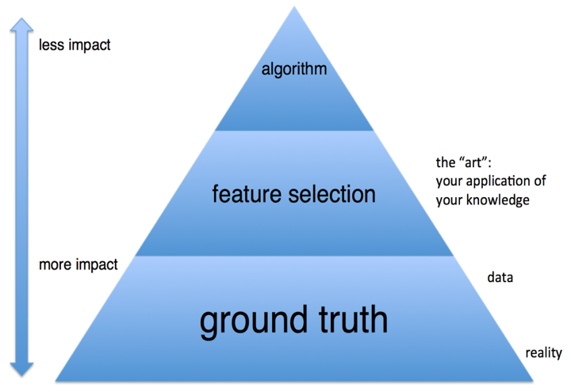

# Feature Engineering & Feature Selection

A comprehensive guide [[pdf]](https://github.com/Yimeng-Zhang/feature-engineering-and-feature-selection/blob/master/A%20Short%20Guide%20for%20Feature%20Engineering%20and%20Feature%20Selection.pdf) [[markdown]](https://github.com/Yimeng-Zhang/feature-engineering-and-feature-selection/blob/master/A%20Short%20Guide%20for%20Feature%20Engineering%20and%20Feature%20Selection.md) for **Feature Engineering** and **Feature Selection**, with implementations and examples in Python.

## Motivation

Feature Engineering & Selection is the most essential part of building a useable machine learning project, even though hundreds of cutting-edge machine learning algorithms coming in these days like deep learning and transfer learning. Indeed, like what Prof Domingos, the author of  'The Master Algorithm' says:

> “At the end of the day, some machine learning projects succeed and some fail. What makes the difference? Easily the most important factor is the features used.”
>
> — Prof. Pedro Domingos

Data and feature has the most impact on a ML project and sets the limit of how well we can do, while models and algorithms are just approaching that limit. However, few materials could be found that systematically introduce the art of feature engineering, and even fewer could explain the rationale behind. This repo is my personal notes from learning ML and serves as a reference for Feature Engineering & Selection.

## Download

Download the PDF here:

- https://github.com/Yimeng-Zhang/feature-engineering-and-feature-selection/blob/master/A%20Short%20Guide%20for%20Feature%20Engineering%20and%20Feature%20Selection.pdf

Same, but in markdown:

- https://github.com/Yimeng-Zhang/feature-engineering-and-feature-selection/blob/master/A%20Short%20Guide%20for%20Feature%20Engineering%20and%20Feature%20Selection.md

PDF has a much readable format, while Markdown has auto-generated anchor link to navigate from outer source. GitHub sucks at displaying markdown with complex grammar, so I would suggest read the PDF or download the repo and read markdown with [Typora](https://typora.io/). 

## What You'll Learn

Not only a collection of hands-on functions, but also explanation on  **Why**, **How** and **When** to adopt **Which** techniques of feature engineering in data mining. 

- the nature and risk of data problem we often encounter
- explanation of the various feature engineering & selection techniques
- rationale to use it
- pros & cons of each method 
- code & example

## Getting Started

This repo is mainly used as a reference for anyone who are doing feature engineering, and most of the modules are implemented through scikit-learn or its communities.

To run the demos or use the customized function,  please download the ZIP file from the repo or just copy-paste any part of the code you find helpful. They should all be very easy to understand.

**Required Dependencies**:

- Python 3.5, 3.6 or 3.7
- numpy>=1.15
- pandas>=0.23
- scipy>=1.1.0
- scikit_learn>=0.20.1
- seaborn>=0.9.0

## Table of Contents and Code Examples

Below is a list of methods currently implemented in the repo. 

**1. Data Exploration**

  -    1.1 Variables 
  -    1.2 Variable Identification  
       -  Check Data Types   [[guide]](https://github.com/Yimeng-Zhang/feature-engineering-and-feature-selection/blob/master/A%20Short%20Guide%20for%20Feature%20Engineering%20and%20Feature%20Selection.md#12-variable-identification)  [[demo]](https://github.com/Yimeng-Zhang/feature-engineering-and-feature-selection/blob/master/1_Demo_Data_Explore.ipynb)
  -    1.3 Univariate Analysis  
       -  Descriptive Analysis   [[guide]](https://github.com/Yimeng-Zhang/feature-engineering-and-feature-selection/blob/master/A%20Short%20Guide%20for%20Feature%20Engineering%20and%20Feature%20Selection.md#13-univariate-analysis)   [[demo]](https://github.com/Yimeng-Zhang/feature-engineering-and-feature-selection/blob/master/1_Demo_Data_Explore.ipynb)  
       -  Discrete Variable Barplot   [[guide]](https://github.com/Yimeng-Zhang/feature-engineering-and-feature-selection/blob/master/A%20Short%20Guide%20for%20Feature%20Engineering%20and%20Feature%20Selection.md#13-univariate-analysis)   [[demo]](https://github.com/Yimeng-Zhang/feature-engineering-and-feature-selection/blob/master/1_Demo_Data_Explore.ipynb)  
       -  Discrete Variable Countplot   [[guide]](https://github.com/Yimeng-Zhang/feature-engineering-and-feature-selection/blob/master/A%20Short%20Guide%20for%20Feature%20Engineering%20and%20Feature%20Selection.md#13-univariate-analysis)   [[demo]](https://github.com/Yimeng-Zhang/feature-engineering-and-feature-selection/blob/master/1_Demo_Data_Explore.ipynb)  
       -  Discrete Variable Boxplot   [[guide]](https://github.com/Yimeng-Zhang/feature-engineering-and-feature-selection/blob/master/A%20Short%20Guide%20for%20Feature%20Engineering%20and%20Feature%20Selection.md#13-univariate-analysis)   [[demo]](https://github.com/Yimeng-Zhang/feature-engineering-and-feature-selection/blob/master/1_Demo_Data_Explore.ipynb)  
       -  Continuous Variable Distplot   [[guide]](https://github.com/Yimeng-Zhang/feature-engineering-and-feature-selection/blob/master/A%20Short%20Guide%20for%20Feature%20Engineering%20and%20Feature%20Selection.md#13-univariate-analysis)   [[demo]](https://github.com/Yimeng-Zhang/feature-engineering-and-feature-selection/blob/master/1_Demo_Data_Explore.ipynb)
  -    1.4 Bi-variate Analysis  
       -  Scatter Plot   [[guide]](https://github.com/Yimeng-Zhang/feature-engineering-and-feature-selection/blob/master/A%20Short%20Guide%20for%20Feature%20Engineering%20and%20Feature%20Selection.md#14-bi-variate-analysis)   [[demo]](https://github.com/Yimeng-Zhang/feature-engineering-and-feature-selection/blob/master/1_Demo_Data_Explore.ipynb)  
       -  Correlation Plot   [[guide]](https://github.com/Yimeng-Zhang/feature-engineering-and-feature-selection/blob/master/A%20Short%20Guide%20for%20Feature%20Engineering%20and%20Feature%20Selection.md#14-bi-variate-analysis)   [[demo]](https://github.com/Yimeng-Zhang/feature-engineering-and-feature-selection/blob/master/1_Demo_Data_Explore.ipynb)  
       -  Heat Map   [[guide]](https://github.com/Yimeng-Zhang/feature-engineering-and-feature-selection/blob/master/A%20Short%20Guide%20for%20Feature%20Engineering%20and%20Feature%20Selection.md#14-bi-variate-analysis)   [[demo]](https://github.com/Yimeng-Zhang/feature-engineering-and-feature-selection/blob/master/1_Demo_Data_Explore.ipynb)

**2. Feature Cleaning**

  -    2.1 Missing Values  
       -  Missing Value Check   [[guide]](https://github.com/Yimeng-Zhang/feature-engineering-and-feature-selection/blob/master/A%20Short%20Guide%20for%20Feature%20Engineering%20and%20Feature%20Selection.md#214-how-to-handle-missing-data)   [[demo]](https://github.com/Yimeng-Zhang/feature-engineering-and-feature-selection/blob/master/2.1_Demo_Missing_Data.ipynb)  
       -  Listwise Deletion   [[guide]](https://github.com/Yimeng-Zhang/feature-engineering-and-feature-selection/blob/master/A%20Short%20Guide%20for%20Feature%20Engineering%20and%20Feature%20Selection.md#214-how-to-handle-missing-data)   [[demo]](https://github.com/Yimeng-Zhang/feature-engineering-and-feature-selection/blob/master/2.1_Demo_Missing_Data.ipynb)  
       -  Mean/Median/Mode Imputation   [[guide]](https://github.com/Yimeng-Zhang/feature-engineering-and-feature-selection/blob/master/A%20Short%20Guide%20for%20Feature%20Engineering%20and%20Feature%20Selection.md#214-how-to-handle-missing-data)   [[demo]](https://github.com/Yimeng-Zhang/feature-engineering-and-feature-selection/blob/master/2.1_Demo_Missing_Data.ipynb)  
       -  End of distribution Imputation   [[guide]](https://github.com/Yimeng-Zhang/feature-engineering-and-feature-selection/blob/master/A%20Short%20Guide%20for%20Feature%20Engineering%20and%20Feature%20Selection.md#214-how-to-handle-missing-data)   [[demo]](https://github.com/Yimeng-Zhang/feature-engineering-and-feature-selection/blob/master/2.1_Demo_Missing_Data.ipynb)  
       -  Random Imputation   [[guide]](https://github.com/Yimeng-Zhang/feature-engineering-and-feature-selection/blob/master/A%20Short%20Guide%20for%20Feature%20Engineering%20and%20Feature%20Selection.md#214-how-to-handle-missing-data)   [[demo]](https://github.com/Yimeng-Zhang/feature-engineering-and-feature-selection/blob/master/2.1_Demo_Missing_Data.ipynb)  
       -  Arbitrary Value Imputation   [[guide]](https://github.com/Yimeng-Zhang/feature-engineering-and-feature-selection/blob/master/A%20Short%20Guide%20for%20Feature%20Engineering%20and%20Feature%20Selection.md#214-how-to-handle-missing-data)   [[demo]](https://github.com/Yimeng-Zhang/feature-engineering-and-feature-selection/blob/master/2.1_Demo_Missing_Data.ipynb)  
       -  Add a variable to denote NA   [[guide]](https://github.com/Yimeng-Zhang/feature-engineering-and-feature-selection/blob/master/A%20Short%20Guide%20for%20Feature%20Engineering%20and%20Feature%20Selection.md#214-how-to-handle-missing-data)   [[demo]](https://github.com/Yimeng-Zhang/feature-engineering-and-feature-selection/blob/master/2.1_Demo_Missing_Data.ipynb)
  -    2.2 Outliers  
       -  Detect by Arbitrary Boundary   [[guide]](https://github.com/Yimeng-Zhang/feature-engineering-and-feature-selection/blob/master/A%20Short%20Guide%20for%20Feature%20Engineering%20and%20Feature%20Selection.md#222-outlier-detection)   [[demo]](https://github.com/Yimeng-Zhang/feature-engineering-and-feature-selection/blob/master/2.2_Demo_Outlier.ipynb)  
       -  Detect by Mean & Standard Deviation   [[guide]](https://github.com/Yimeng-Zhang/feature-engineering-and-feature-selection/blob/master/A%20Short%20Guide%20for%20Feature%20Engineering%20and%20Feature%20Selection.md#222-outlier-detection)   [[demo]](https://github.com/Yimeng-Zhang/feature-engineering-and-feature-selection/blob/master/2.2_Demo_Outlier.ipynb)  
       -  Detect by IQR    [[guide]](https://github.com/Yimeng-Zhang/feature-engineering-and-feature-selection/blob/master/A%20Short%20Guide%20for%20Feature%20Engineering%20and%20Feature%20Selection.md#222-outlier-detection)   [[demo]](https://github.com/Yimeng-Zhang/feature-engineering-and-feature-selection/blob/master/2.2_Demo_Outlier.ipynb)  
       -  Detect by MAD      [[guide]](https://github.com/Yimeng-Zhang/feature-engineering-and-feature-selection/blob/master/A%20Short%20Guide%20for%20Feature%20Engineering%20and%20Feature%20Selection.md#222-outlier-detection)   [[demo]](https://github.com/Yimeng-Zhang/feature-engineering-and-feature-selection/blob/master/2.2_Demo_Outlier.ipynb)  
       -  Mean/Median/Mode Imputation   [[guide]](https://github.com/Yimeng-Zhang/feature-engineering-and-feature-selection/blob/master/A%20Short%20Guide%20for%20Feature%20Engineering%20and%20Feature%20Selection.md#223-how-to-handle-outliers)   [[demo]](https://github.com/Yimeng-Zhang/feature-engineering-and-feature-selection/blob/master/2.2_Demo_Outlier.ipynb)  
       -  Discretization   [[guide]](https://github.com/Yimeng-Zhang/feature-engineering-and-feature-selection/blob/master/A%20Short%20Guide%20for%20Feature%20Engineering%20and%20Feature%20Selection.md#223-how-to-handle-outliers)   [[demo]](https://github.com/Yimeng-Zhang/feature-engineering-and-feature-selection/blob/master/3.2_Demo_Discretisation.ipynb)  
       -  Imputation with Arbitrary Value   [[guide]](https://github.com/Yimeng-Zhang/feature-engineering-and-feature-selection/blob/master/A%20Short%20Guide%20for%20Feature%20Engineering%20and%20Feature%20Selection.md#223-how-to-handle-outliers)   [[demo]](https://github.com/Yimeng-Zhang/feature-engineering-and-feature-selection/blob/master/2.2_Demo_Outlier.ipynb)  
       -  Windsorization   [[guide]](https://github.com/Yimeng-Zhang/feature-engineering-and-feature-selection/blob/master/A%20Short%20Guide%20for%20Feature%20Engineering%20and%20Feature%20Selection.md#223-how-to-handle-outliers)   [[demo]](https://github.com/Yimeng-Zhang/feature-engineering-and-feature-selection/blob/master/2.2_Demo_Outlier.ipynb)  
       -  Discard Outliers   [[guide]](https://github.com/Yimeng-Zhang/feature-engineering-and-feature-selection/blob/master/A%20Short%20Guide%20for%20Feature%20Engineering%20and%20Feature%20Selection.md#223-how-to-handle-outliers)   [[demo]](https://github.com/Yimeng-Zhang/feature-engineering-and-feature-selection/blob/master/2.2_Demo_Outlier.ipynb)
  -    2.3 Rare Values  
       -  Mode Imputation     [[guide]](https://github.com/Yimeng-Zhang/feature-engineering-and-feature-selection/blob/master/A%20Short%20Guide%20for%20Feature%20Engineering%20and%20Feature%20Selection.md#23-rare-values)   [[demo]](https://github.com/Yimeng-Zhang/feature-engineering-and-feature-selection/blob/master/2.3_Demo_Rare_Values.ipynb)  
       -  Grouping into One New Category   [[guide]](https://github.com/Yimeng-Zhang/feature-engineering-and-feature-selection/blob/master/A%20Short%20Guide%20for%20Feature%20Engineering%20and%20Feature%20Selection.md#23-rare-values)   [[demo]](https://github.com/Yimeng-Zhang/feature-engineering-and-feature-selection/blob/master/2.3_Demo_Rare_Values.ipynb)
  -    2.4 High Cardinality  
       -  Grouping Labels with Business Understanding    [[guide]](https://github.com/Yimeng-Zhang/feature-engineering-and-feature-selection/blob/master/A%20Short%20Guide%20for%20Feature%20Engineering%20and%20Feature%20Selection.md#24-high-cardinality)   
       -  Grouping Labels with Rare Occurrence into One Category   [[guide]](https://github.com/Yimeng-Zhang/feature-engineering-and-feature-selection/blob/master/A%20Short%20Guide%20for%20Feature%20Engineering%20and%20Feature%20Selection.md#24-high-cardinality)   [[demo]](https://github.com/Yimeng-Zhang/feature-engineering-and-feature-selection/blob/master/2.3_Demo_Rare_Values.ipynb)  
       -  Grouping Labels with Decision Tree   [[guide]](https://github.com/Yimeng-Zhang/feature-engineering-and-feature-selection/blob/master/A%20Short%20Guide%20for%20Feature%20Engineering%20and%20Feature%20Selection.md#24-high-cardinality)   [[demo]](https://github.com/Yimeng-Zhang/feature-engineering-and-feature-selection/blob/master/3.2_Demo_Discretisation.ipynb)

**3. Feature Engineering**
  -    3.1 Feature Scaling    
       -  Normalization - Standardization    [[guide]](https://github.com/Yimeng-Zhang/feature-engineering-and-feature-selection/blob/master/A%20Short%20Guide%20for%20Feature%20Engineering%20and%20Feature%20Selection.md#31-feature-scaling)   [[demo]](https://github.com/Yimeng-Zhang/feature-engineering-and-feature-selection/blob/master/3.1_Demo_Feature_Scaling.ipynb)  
       -  Min-Max Scaling   [[guide]](https://github.com/Yimeng-Zhang/feature-engineering-and-feature-selection/blob/master/A%20Short%20Guide%20for%20Feature%20Engineering%20and%20Feature%20Selection.md#31-feature-scaling)   [[demo]](https://github.com/Yimeng-Zhang/feature-engineering-and-feature-selection/blob/master/3.1_Demo_Feature_Scaling.ipynb)  
       -  Robust Scaling   [[guide]](https://github.com/Yimeng-Zhang/feature-engineering-and-feature-selection/blob/master/A%20Short%20Guide%20for%20Feature%20Engineering%20and%20Feature%20Selection.md#31-feature-scaling)   [[demo]](https://github.com/Yimeng-Zhang/feature-engineering-and-feature-selection/blob/master/3.1_Demo_Feature_Scaling.ipynb)
  -    3.2 Discretize     
       -  Equal Width Binning   [[guide]](https://github.com/Yimeng-Zhang/feature-engineering-and-feature-selection/blob/master/A%20Short%20Guide%20for%20Feature%20Engineering%20and%20Feature%20Selection.md#32-discretize)   [[demo]](https://github.com/Yimeng-Zhang/feature-engineering-and-feature-selection/blob/master/3.2_Demo_Discretisation.ipynb)  
       -  Equal Frequency Binning   [[guide]](https://github.com/Yimeng-Zhang/feature-engineering-and-feature-selection/blob/master/A%20Short%20Guide%20for%20Feature%20Engineering%20and%20Feature%20Selection.md#32-discretize)   [[demo]](https://github.com/Yimeng-Zhang/feature-engineering-and-feature-selection/blob/master/3.2_Demo_Discretisation.ipynb)  
       -  K-means Binning      [[guide]](https://github.com/Yimeng-Zhang/feature-engineering-and-feature-selection/blob/master/A%20Short%20Guide%20for%20Feature%20Engineering%20and%20Feature%20Selection.md#32-discretize)   [[demo]](https://github.com/Yimeng-Zhang/feature-engineering-and-feature-selection/blob/master/3.2_Demo_Discretisation.ipynb)  
       -  Discretization by Decision Trees   [[guide]](https://github.com/Yimeng-Zhang/feature-engineering-and-feature-selection/blob/master/A%20Short%20Guide%20for%20Feature%20Engineering%20and%20Feature%20Selection.md#32-discretize)   [[demo]](https://github.com/Yimeng-Zhang/feature-engineering-and-feature-selection/blob/master/3.2_Demo_Discretisation.ipynb)  
       -  ChiMerge   [[guide]](https://github.com/Yimeng-Zhang/feature-engineering-and-feature-selection/blob/master/A%20Short%20Guide%20for%20Feature%20Engineering%20and%20Feature%20Selection.md#32-discretize)   [[demo]](https://github.com/Yimeng-Zhang/feature-engineering-and-feature-selection/blob/master/3.2_Demo_Discretisation.ipynb)
  -    3.3 Feature Encoding  
       -  One-hot Encoding   [[guide]](https://github.com/Yimeng-Zhang/feature-engineering-and-feature-selection/blob/master/A%20Short%20Guide%20for%20Feature%20Engineering%20and%20Feature%20Selection.md#33-feature-encoding)   [[demo]](https://github.com/Yimeng-Zhang/feature-engineering-and-feature-selection/blob/master/3.3_Demo_Feature_Encoding.ipynb)  
       -  Ordinal-Encoding   [[guide]](https://github.com/Yimeng-Zhang/feature-engineering-and-feature-selection/blob/master/A%20Short%20Guide%20for%20Feature%20Engineering%20and%20Feature%20Selection.md#33-feature-encoding)   [[demo]](https://github.com/Yimeng-Zhang/feature-engineering-and-feature-selection/blob/master/3.3_Demo_Feature_Encoding.ipynb)  
       -  Count/frequency Encoding    [[guide]](https://github.com/Yimeng-Zhang/feature-engineering-and-feature-selection/blob/master/A%20Short%20Guide%20for%20Feature%20Engineering%20and%20Feature%20Selection.md#33-feature-encoding)   
       -  Mean Encoding   [[guide]](https://github.com/Yimeng-Zhang/feature-engineering-and-feature-selection/blob/master/A%20Short%20Guide%20for%20Feature%20Engineering%20and%20Feature%20Selection.md#33-feature-encoding)   [[demo]](https://github.com/Yimeng-Zhang/feature-engineering-and-feature-selection/blob/master/3.3_Demo_Feature_Encoding.ipynb)  
       -  WOE Encoding   [[guide]](https://github.com/Yimeng-Zhang/feature-engineering-and-feature-selection/blob/master/A%20Short%20Guide%20for%20Feature%20Engineering%20and%20Feature%20Selection.md#33-feature-encoding)   [[demo]](https://github.com/Yimeng-Zhang/feature-engineering-and-feature-selection/blob/master/3.3_Demo_Feature_Encoding.ipynb)  
       -  Target Encoding   [[guide]](https://github.com/Yimeng-Zhang/feature-engineering-and-feature-selection/blob/master/A%20Short%20Guide%20for%20Feature%20Engineering%20and%20Feature%20Selection.md#33-feature-encoding)   [[demo]](https://github.com/Yimeng-Zhang/feature-engineering-and-feature-selection/blob/master/3.3_Demo_Feature_Encoding.ipynb)
  -    3.4 Feature Transformation  
       -  Logarithmic Transformation   [[guide]](https://github.com/Yimeng-Zhang/feature-engineering-and-feature-selection/blob/master/A%20Short%20Guide%20for%20Feature%20Engineering%20and%20Feature%20Selection.md#34-feature-transformation)   [[demo]](https://github.com/Yimeng-Zhang/feature-engineering-and-feature-selection/blob/master/3.4_Demo_Feature_Transformation.ipynb)  
       -  Reciprocal Transformation   [[guide]](https://github.com/Yimeng-Zhang/feature-engineering-and-feature-selection/blob/master/A%20Short%20Guide%20for%20Feature%20Engineering%20and%20Feature%20Selection.md#34-feature-transformation)   [[demo]](https://github.com/Yimeng-Zhang/feature-engineering-and-feature-selection/blob/master/3.4_Demo_Feature_Transformation.ipynb)  
       -  Square Root Transformation   [[guide]](https://github.com/Yimeng-Zhang/feature-engineering-and-feature-selection/blob/master/A%20Short%20Guide%20for%20Feature%20Engineering%20and%20Feature%20Selection.md#34-feature-transformation)   [[demo]](https://github.com/Yimeng-Zhang/feature-engineering-and-feature-selection/blob/master/3.4_Demo_Feature_Transformation.ipynb)  
       -  Exponential Transformation   [[guide]](https://github.com/Yimeng-Zhang/feature-engineering-and-feature-selection/blob/master/A%20Short%20Guide%20for%20Feature%20Engineering%20and%20Feature%20Selection.md#34-feature-transformation)   [[demo]](https://github.com/Yimeng-Zhang/feature-engineering-and-feature-selection/blob/master/3.4_Demo_Feature_Transformation.ipynb)  
       -  Box-cox Transformation   [[guide]](https://github.com/Yimeng-Zhang/feature-engineering-and-feature-selection/blob/master/A%20Short%20Guide%20for%20Feature%20Engineering%20and%20Feature%20Selection.md#34-feature-transformation)   [[demo]](https://github.com/Yimeng-Zhang/feature-engineering-and-feature-selection/blob/master/3.4_Demo_Feature_Transformation.ipynb)  
       -  Quantile Transformation   [[guide]](https://github.com/Yimeng-Zhang/feature-engineering-and-feature-selection/blob/master/A%20Short%20Guide%20for%20Feature%20Engineering%20and%20Feature%20Selection.md#34-feature-transformation)   [[demo]](https://github.com/Yimeng-Zhang/feature-engineering-and-feature-selection/blob/master/3.4_Demo_Feature_Transformation.ipynb)
  -    3.5 Feature Generation  
       -  Missing Data Derived   [[guide]](https://github.com/Yimeng-Zhang/feature-engineering-and-feature-selection/blob/master/A%20Short%20Guide%20for%20Feature%20Engineering%20and%20Feature%20Selection.md#35-feature-generation)   [[demo]](https://github.com/Yimeng-Zhang/feature-engineering-and-feature-selection/blob/master/2.1_Demo_Missing_Data.ipynb)  
       -  Simple Stats   [[guide]](https://github.com/Yimeng-Zhang/feature-engineering-and-feature-selection/blob/master/A%20Short%20Guide%20for%20Feature%20Engineering%20and%20Feature%20Selection.md#35-feature-generation)   
       -  Crossing   [[guide]](https://github.com/Yimeng-Zhang/feature-engineering-and-feature-selection/blob/master/A%20Short%20Guide%20for%20Feature%20Engineering%20and%20Feature%20Selection.md#35-feature-generation)   
       -  Ratio & Proportion   [[guide]](https://github.com/Yimeng-Zhang/feature-engineering-and-feature-selection/blob/master/A%20Short%20Guide%20for%20Feature%20Engineering%20and%20Feature%20Selection.md#35-feature-generation)   
       -  Cross Product   [[guide]](https://github.com/Yimeng-Zhang/feature-engineering-and-feature-selection/blob/master/A%20Short%20Guide%20for%20Feature%20Engineering%20and%20Feature%20Selection.md#35-feature-generation)   
       -  Polynomial   [[guide]](https://github.com/Yimeng-Zhang/feature-engineering-and-feature-selection/blob/master/A%20Short%20Guide%20for%20Feature%20Engineering%20and%20Feature%20Selection.md#35-feature-generation)  [[demo]](https://github.com/Yimeng-Zhang/feature-engineering-and-feature-selection/blob/master/3.5_Demo_Feature_Generation.ipynb)  
       -  Feature Learning by Tree   [[guide]](https://github.com/Yimeng-Zhang/feature-engineering-and-feature-selection/blob/master/A%20Short%20Guide%20for%20Feature%20Engineering%20and%20Feature%20Selection.md#35-feature-generation)   [[demo]](https://github.com/Yimeng-Zhang/feature-engineering-and-feature-selection/blob/master/3.5_Demo_Feature_Generation.ipynb)  
       -  Feature Learning by Deep Network   [[guide]](https://github.com/Yimeng-Zhang/feature-engineering-and-feature-selection/blob/master/A%20Short%20Guide%20for%20Feature%20Engineering%20and%20Feature%20Selection.md#35-feature-generation)  

**4. Feature Selection**

  -    4.1 Filter Method  
       -  Variance   [[guide]](https://github.com/Yimeng-Zhang/feature-engineering-and-feature-selection/blob/master/A%20Short%20Guide%20for%20Feature%20Engineering%20and%20Feature%20Selection.md#41-filter-method)   [[demo]](https://github.com/Yimeng-Zhang/feature-engineering-and-feature-selection/blob/master/4.1_Demo_Feature_Selection_Filter.ipynb)  
       -  Correlation   [[guide]](https://github.com/Yimeng-Zhang/feature-engineering-and-feature-selection/blob/master/A%20Short%20Guide%20for%20Feature%20Engineering%20and%20Feature%20Selection.md#41-filter-method)   [[demo]](https://github.com/Yimeng-Zhang/feature-engineering-and-feature-selection/blob/master/4.1_Demo_Feature_Selection_Filter.ipynb)  
       -  Chi-Square   [[guide]](https://github.com/Yimeng-Zhang/feature-engineering-and-feature-selection/blob/master/A%20Short%20Guide%20for%20Feature%20Engineering%20and%20Feature%20Selection.md#41-filter-method)   [[demo]](https://github.com/Yimeng-Zhang/feature-engineering-and-feature-selection/blob/master/4.1_Demo_Feature_Selection_Filter.ipynb)  
       -  Mutual Information Filter   [[guide]](https://github.com/Yimeng-Zhang/feature-engineering-and-feature-selection/blob/master/A%20Short%20Guide%20for%20Feature%20Engineering%20and%20Feature%20Selection.md#41-filter-method)   [[demo]](https://github.com/Yimeng-Zhang/feature-engineering-and-feature-selection/blob/master/4.1_Demo_Feature_Selection_Filter.ipynb)  
       -  Information Value (IV)   [[guide]](https://github.com/Yimeng-Zhang/feature-engineering-and-feature-selection/blob/master/A%20Short%20Guide%20for%20Feature%20Engineering%20and%20Feature%20Selection.md#41-filter-method) 
  -    4.2 Wrapper Method  
       -  Forward Selection   [[guide]](https://github.com/Yimeng-Zhang/feature-engineering-and-feature-selection/blob/master/A%20Short%20Guide%20for%20Feature%20Engineering%20and%20Feature%20Selection.md#42-wrapper-method)   [[demo]](https://github.com/Yimeng-Zhang/feature-engineering-and-feature-selection/blob/master/4.2_Demo_Feature_Selection_Wrapper.ipynb)  
       -  Backward Elimination   [[guide]](https://github.com/Yimeng-Zhang/feature-engineering-and-feature-selection/blob/master/A%20Short%20Guide%20for%20Feature%20Engineering%20and%20Feature%20Selection.md#42-wrapper-method)   [[demo]](https://github.com/Yimeng-Zhang/feature-engineering-and-feature-selection/blob/master/4.2_Demo_Feature_Selection_Wrapper.ipynb)  
       -  Exhaustive Feature Selection   [[guide]](https://github.com/Yimeng-Zhang/feature-engineering-and-feature-selection/blob/master/A%20Short%20Guide%20for%20Feature%20Engineering%20and%20Feature%20Selection.md#42-wrapper-method)   [[demo]](https://github.com/Yimeng-Zhang/feature-engineering-and-feature-selection/blob/master/4.2_Demo_Feature_Selection_Wrapper.ipynb)  
       -  Genetic Algorithm   [[guide]](https://github.com/Yimeng-Zhang/feature-engineering-and-feature-selection/blob/master/A%20Short%20Guide%20for%20Feature%20Engineering%20and%20Feature%20Selection.md#42-wrapper-method) 
  -    4.3 Embedded Method  
       -  Lasso (L1)   [[guide]](https://github.com/Yimeng-Zhang/feature-engineering-and-feature-selection/blob/master/A%20Short%20Guide%20for%20Feature%20Engineering%20and%20Feature%20Selection.md#43-embedded-method)   [[demo]](https://github.com/Yimeng-Zhang/feature-engineering-and-feature-selection/blob/master/4.3_Demo_Feature_Selection_Embedded.ipynb)  
       -  Random Forest Importance   [[guide]](https://github.com/Yimeng-Zhang/feature-engineering-and-feature-selection/blob/master/A%20Short%20Guide%20for%20Feature%20Engineering%20and%20Feature%20Selection.md#43-embedded-method)   [[demo]](https://github.com/Yimeng-Zhang/feature-engineering-and-feature-selection/blob/master/4.3_Demo_Feature_Selection_Embedded.ipynb)  
       -  Gradient Boosted Trees Importance   [[guide]](https://github.com/Yimeng-Zhang/feature-engineering-and-feature-selection/blob/master/A%20Short%20Guide%20for%20Feature%20Engineering%20and%20Feature%20Selection.md#43-embedded-method)   [[demo]](https://github.com/Yimeng-Zhang/feature-engineering-and-feature-selection/blob/master/4.3_Demo_Feature_Selection_Embedded.ipynb)
  -    4.4 Feature Shuffling  
       -  Random Shuffling   [[guide]](https://github.com/Yimeng-Zhang/feature-engineering-and-feature-selection/blob/master/A%20Short%20Guide%20for%20Feature%20Engineering%20and%20Feature%20Selection.md#44-feature-shuffling)   [[demo]](https://github.com/Yimeng-Zhang/feature-engineering-and-feature-selection/blob/master/4.4_Demo_Feature_Selection_Feature_Shuffling.ipynb)
  -    4.5 Hybrid Method  
       -  Recursive Feature Selection    [[guide]](https://github.com/Yimeng-Zhang/feature-engineering-and-feature-selection/blob/master/A%20Short%20Guide%20for%20Feature%20Engineering%20and%20Feature%20Selection.md#451-recursive-feature-elimination)   [[demo]](https://github.com/Yimeng-Zhang/feature-engineering-and-feature-selection/blob/master/4.5_Demo_Feature_Selection_Hybrid_method.ipynb)  
       -  Recursive Feature Addition   [[guide]](https://github.com/Yimeng-Zhang/feature-engineering-and-feature-selection/blob/master/A%20Short%20Guide%20for%20Feature%20Engineering%20and%20Feature%20Selection.md#452-recursive-feature-addition)   [[demo]](https://github.com/Yimeng-Zhang/feature-engineering-and-feature-selection/blob/master/4.5_Demo_Feature_Selection_Hybrid_method.ipynb)

## Key Links and Resources

- Udemy's Feature Engineering online course

https://www.udemy.com/feature-engineering-for-machine-learning/

- Udemy's Feature Selection online course

https://www.udemy.com/feature-selection-for-machine-learning

- JMLR Special Issue on Variable and Feature Selection

http://jmlr.org/papers/special/feature03.html

- Data Analysis Using Regression and Multilevel/Hierarchical Models, Chapter 25: Missing data

http://www.stat.columbia.edu/~gelman/arm/missing.pdf

- Data mining and the impact of missing data

http://core.ecu.edu/omgt/krosj/IMDSDataMining2003.pdf

- PyOD: A Python Toolkit for Scalable Outlier Detection

https://github.com/yzhao062/pyod

- Weight of Evidence (WoE) Introductory Overview

http://documentation.statsoft.com/StatisticaHelp.aspx?path=WeightofEvidence/WeightofEvidenceWoEIntroductoryOverview

- About Feature Scaling and Normalization

http://sebastianraschka.com/Articles/2014_about_feature_scaling.html

- Feature Generation with RF, GBDT and Xgboost

https://blog.csdn.net/anshuai_aw1/article/details/82983997

- A review of feature selection methods with applications

https://ieeexplore.ieee.org/iel7/7153596/7160221/07160458.pdf

